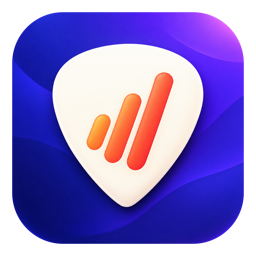

# Guitar Practice Lab

<p align="center">
  
</p>

<p align="center">
  <a href="https://github.com/abogadophermosilla-ship-it/GuitarPracticeLab/actions/workflows/ci.yml"></a>
  <a href="LICENSE"></a>
</p>

Una aplicación nativa para macOS que reúne planificación de práctica, seguimiento del progreso,
entrenamiento auditivo y herramientas de IA para guitarristas.

> **Estado:** versión temprana para desarrollo y pruebas. Todavía no se distribuye como aplicación
> firmada o notarizada; se ejecuta desde Xcode.

## Qué incluye

- Plan diario y cronómetro que registra cada ejercicio de una sesión.
- Perfil de habilidades basado en evidencias, retención y revisiones en frío.
- Entrenamiento del mástil con detección local de altura mediante micrófono.
- Laboratorio de ritmo, metrónomo y entrenamiento auditivo.
- Biblioteca de ejercicios, conceptos, libros y materiales del usuario.
- Repertorio, clases, grabaciones, instrumentos y analítica de progreso.
- Profesor de IA con contexto de práctica, fuentes citables y acciones confirmables.
- Proveedores configurables: Gemini, Ollama local y un gateway Hermes opcional.

La aplicación funciona sin una cuenta central. Las funciones que dependen de servicios externos son
opcionales y degradan de forma segura cuando el proveedor no está disponible.

## Requisitos

- macOS 14 o posterior.
- Xcode 26.6 o posterior para reproducir el entorno verificado actualmente.
- Una cuenta gratuita de Apple Developer si quieres ejecutar una compilación firmada.
- [XcodeGen](https://github.com/yonaskolb/XcodeGen) solo si modificas `project.yml` y quieres regenerar
  el proyecto.

No hay dependencias Swift de terceros.

## Ejecutar el proyecto

1. Clona o descarga este repositorio.
2. Abre `GuitarPracticeLab.xcodeproj` en Xcode.
3. Selecciona el scheme `GuitarPracticeLab-Mac` y el destino **My Mac**.
4. En **Signing & Capabilities**, elige tu propio Development Team.
5. Ejecuta la aplicación con <kbd>⌘R</kbd>.

También puedes compilar y ejecutar los tests sin firma desde Terminal:

```bash
xcodebuild test \
  -project GuitarPracticeLab.xcodeproj \
  -scheme GuitarPracticeLab-Mac \
  -destination 'platform=macOS' \
  CODE_SIGNING_ALLOWED=NO
```

La suite actual contiene 172 tests y se verificó con Xcode 26.6.

## Configurar la IA

Todas las claves se introducen dentro de **Configuración** y se guardan en el Llavero de macOS. No
agregues claves a archivos del proyecto, commits ni issues.

| Integración | Uso | Requisito |
|---|---|---|
| Ollama | Inferencia local y respaldo | Servidor local en `127.0.0.1:11434` y los modelos configurados |
| Gemini | Chat y funciones generativas en la nube | Clave de Gemini API del usuario |
| YouTube Data API | Búsqueda real de material didáctico | Clave de YouTube Data API |
| Hermes | Profesor avanzado experimental | Gateway configurado por el usuario |

Algunos proveedores pueden cobrar por uso. La app muestra controles y estimaciones, pero cada usuario
es responsable de los límites y la facturación de sus propias cuentas.

## Datos y privacidad

- El diario, las sesiones y el perfil de aprendizaje se almacenan localmente con SwiftData.
- Las claves se guardan en el Llavero de macOS.
- El análisis del micrófono y de las grabaciones se realiza localmente; la app no guarda la captura
  temporal de una evaluación práctica.
- Al invocar una función de IA en la nube, el contexto necesario para esa solicitud se envía al
  proveedor configurado. Revisa sus condiciones antes de usarlo con información sensible.
- No hay telemetría remota propia; las mediciones de uso de secciones permanecen en el dispositivo.

## Biblioteca y RAG de libros

El repositorio **no incluye** PDFs, libros comerciales, textos extraídos ni el catálogo personal del
autor. Cada usuario debe aportar material sobre el que tenga derechos y elegir su carpeta desde
Configuración.

El servicio experimental de recuperación de texto completo está documentado en
[`Tools/book-rag/README.md`](Tools/book-rag/README.md). Es opcional y la app sigue funcionando cuando
no está instalado.

## Estructura

- `*.swift`: aplicación SwiftUI, modelos y servicios.
- `Tests/`: tests unitarios y de migración.
- `Resources/`: iconos, `Info.plist` y entitlements.
- `Tools/book-rag/`: servicio Python opcional para recuperación local de pasajes.
- `project.yml`: definición reproducible para XcodeGen.

## Desarrollo asistido por IA

Este proyecto se ha desarrollado con asistencia de herramientas de IA. La IA se usa como una
herramienta de implementación y revisión; las decisiones de producto, la integración, las pruebas y
la responsabilidad sobre lo publicado siguen siendo humanas. Las contribuciones deben revisarse y
probarse independientemente de cómo se haya producido el código.

## Contribuir y seguridad

Consulta [`CONTRIBUTING.md`](CONTRIBUTING.md) antes de enviar cambios. Para vulnerabilidades o posibles
exposiciones de datos, sigue [`SECURITY.md`](SECURITY.md) y evita publicar información sensible en un
issue.

## Licencia

El código se publica bajo la [licencia MIT](LICENSE). Puedes usarlo, modificarlo y redistribuirlo,
incluso comercialmente, siempre que conserves el aviso de copyright y la licencia. Se entrega sin
garantía.

Los libros, canciones, marcas y materiales que cada usuario conecte a la aplicación no forman parte
de esta licencia.
